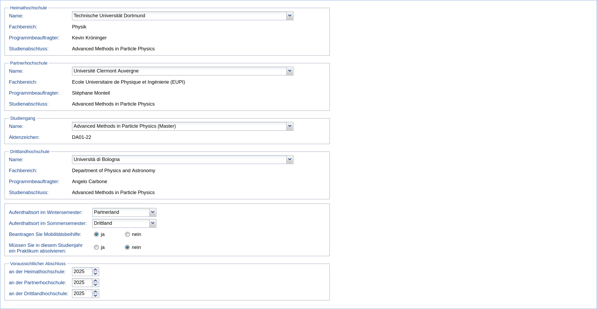
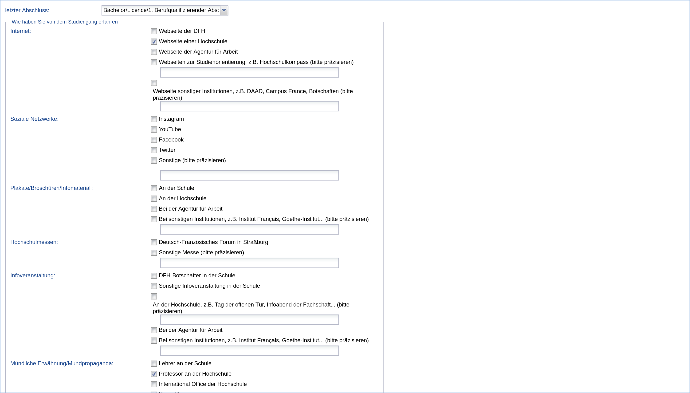
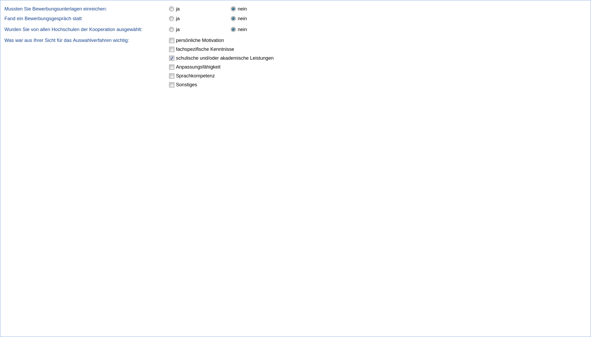
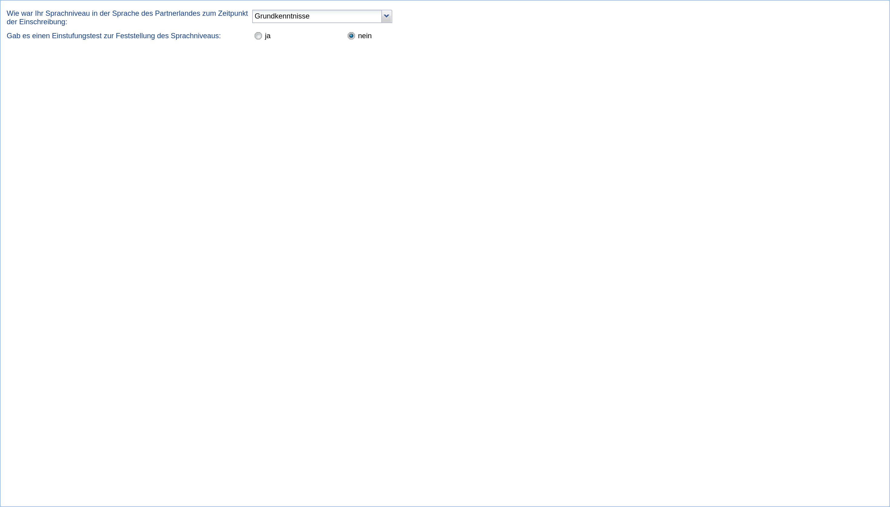
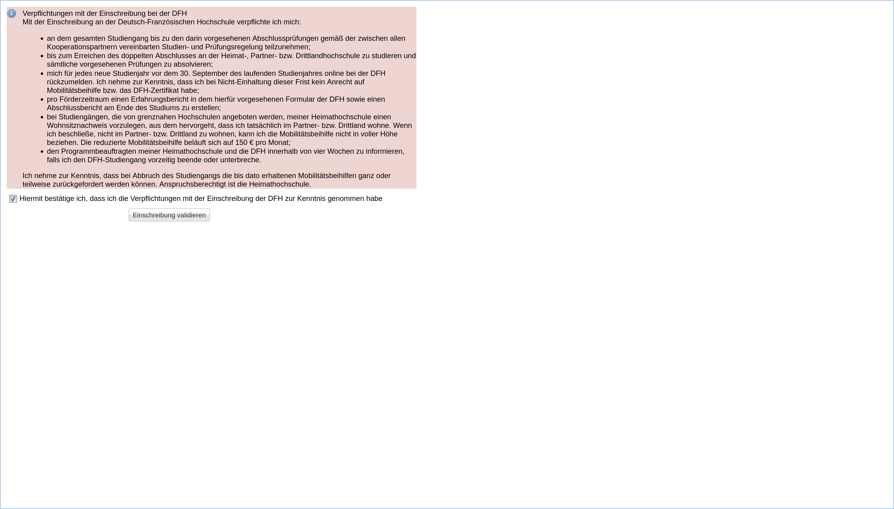
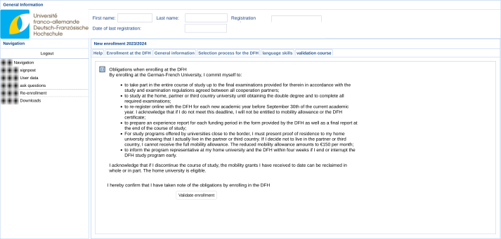
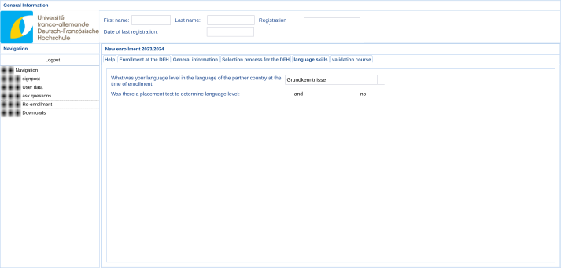
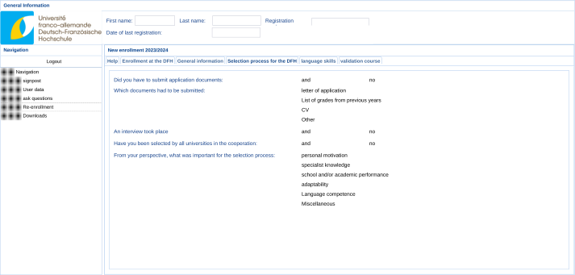
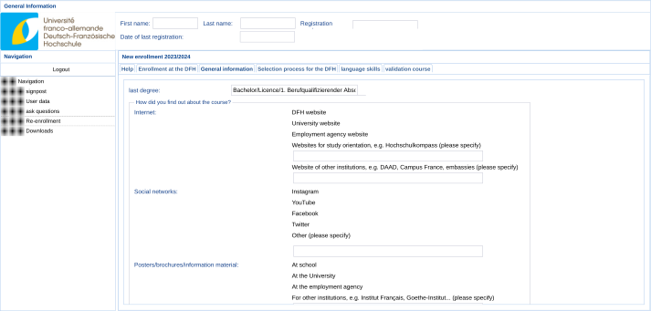
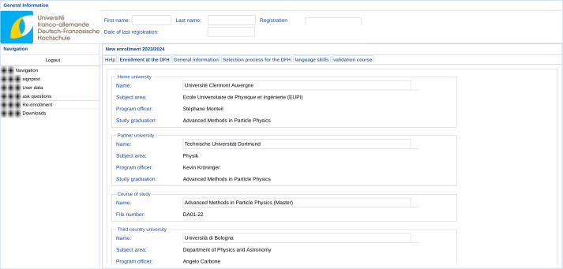

# Enrollment at the Franco-German University


The enrollment/scholarship comes with a few minor obligations, including the submission of a report at the end of the programme.



The website is only available in German and French.


→ [https://www.dfh-ufa.org/informationen-fuer/studierende/einschreibung](https://www.dfh-ufa.org/informationen-fuer/studierende/einschreibung)

* Register an account [here](https://login.dfh-ufa.org/registrierung)
* Log in [here](https://login.dfh-ufa.org/)
* On the menu on the right-hand side, select _Neueinschreibung_
* Below are a few screenshots of what I put
  * [Translated screenshots](enrollment-at-the-franco-german-university.md#translated-screenshots) are at the very bottom (thanks, Eman!)


Nobody has confirmed that I made the correct choices; I'm trying to change that right now…


<figure><figcaption>
We <em>think</em> that <em>Beantragen Sie Mobilitätsbeihilfe</em> means that you want to apply for the scholarship. Consequently, if you already receive the EMJM scholarship, you should not check this box. (Note that you are supposed to enroll anyway.)
</figcaption></figure>

<figure><figcaption></figcaption></figure>

<figure><figcaption></figcaption></figure>

<figure><figcaption></figcaption></figure>

<figure><figcaption></figcaption></figure>

### Translated screenshots

<figure><figcaption></figcaption></figure>

 

<figure><figcaption></figcaption></figure>

 

<figure><figcaption></figcaption></figure>

 

<figure><figcaption></figcaption></figure>

 

<figure><figcaption></figcaption></figure>

