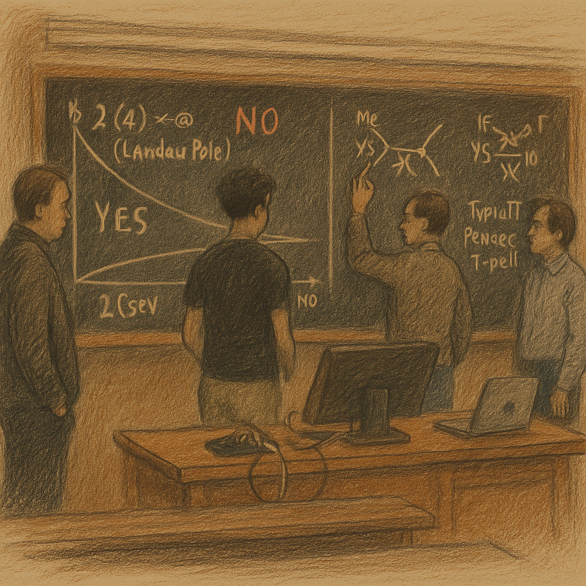

# Exams in Italy

* Exams can be retaken; the latest result counts – including fails!
* Oral exams might be done in front of an audience (other students).
* No normalization is applied to the grades.
  * Importantly, individual exams need to be passed: You can't just pass exam B with a good grade after you failed exam A to pass the overall module.
* As a concession, the professors directly involved with IMAPP might offer brief oral exams to increase the grades of those who barely failed (15–17/30) to the minimal passing grade (18/30).
* Don't be afraid if you've been enrolled in an exam titled _Verbalizzazione_ – it's just for registering the combined grade of exams you passed!
* _Advanced Standard Model_ oral exams:
  * \~95% pass, the grades are not as bad as anticipated
  * take place in a lecture hall; you stand at the blackboard with the professor right beside you
  * While you should prepare things you want to say for each question, this is only a starting point for the exam; you'll probably find that you can't talk for 20 minutes about each of the 10 questions, and the professors usually wouldn't let you. Instead, make sure you understand the context of the question in the lecture to be prepared for _related_ questions that are not strictly part of the questions you had to prepare.
  * You will not be asked / have a chance to elaborate on any question but the one you drew
  *

      <figure><figcaption>
This is what an oral exam in ASM might look like, from the point of view of an observing student
</figcaption></figure>
